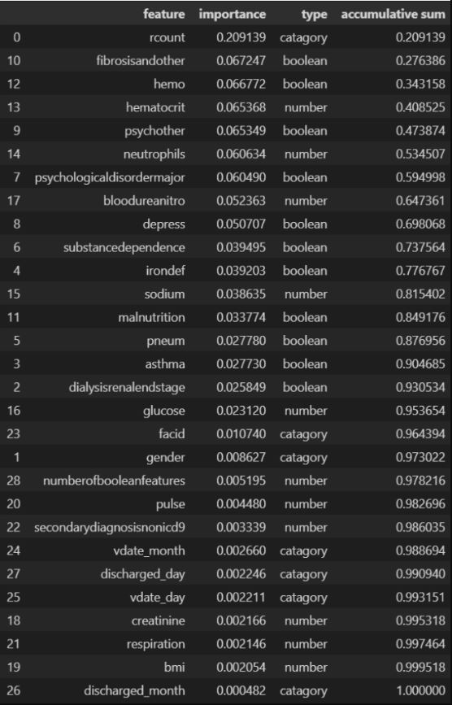
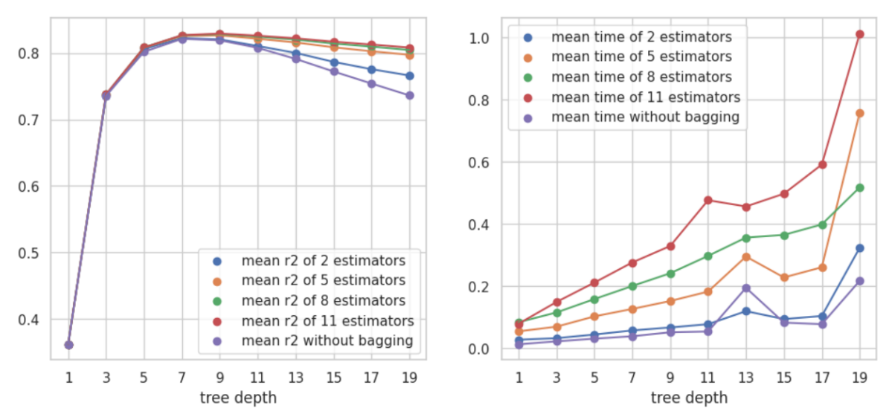

# Introduction

This project uses various machine learning techniques to predict the hospital length of stay of [this data set](https://www.kaggle.com/datasets/aayushchou/hospital-length-of-stay-dataset-microsoft), which includes correlation analysis, random forest classifier, linear regression, feedforward neural networks, decision tree (with bagging), and gradient boosting tree (with bagging).

# Description of the dataset and any preprocessing

The data set named “Hospital Length of Stay” is used in this project, which contains category, date, boolean, and numeric data. This project will use data from some of the features to predict the ‘lengthofstay’. To do so, there are 4 steps for data pre-processing. 
1. Check data integrity. If the null value or duplicated column exists, it will be replaced by mean or removed. 
2. Standardization. The input data for neural networks and decision trees will be standardized because those models contain nonlinear functions. 
3. Handling category data. Convert category data to one-hot encoding vectors. 
4. Data splitting. The data set will be split into a training set and a test set equally. The training set is used to build and validate (cross-validation) the model, and the test set is used to predict the result at the end.

# Description of the machine learning task(s) performed on the dataset

1. Feature creation. It creates new features based on the original features.
2. Dimensionality reduction. It discards the features with low importance, which can reduce the noise of data and increase the model’s accuracy.
3. Regression tasks. It will be performed with various models to find the best one among them and predict the ‘lengthofstay’.

# 1. Feature creation

1.1. Date data are converted to category data according to the day and month.\
1.2. Add a new features call “number_of_issues” to the data set.

# 2. Dimensionality reduction

2.1. Correlation analysis.

Filter the numeric features with low correlation with "lengthofstay".

2.2. Random forest classifier.

Filter the features with low importantance.

# 3. Compare different regression models

## 3.1. Linear Regression

Build linear regression models with all selected features and the combination of them (prediction graphs are plot in the ipynb file).

The best one in terms of r2 score is "numberOfBooleanFeature".

## 3.2. Feedforward Neural Networks

Build feedforward neural networks models with 3 hidden layer and [1, 4, 16, 64, 128] hidden units.

## 3.3. Decision Tree (with/without bagging)

Build decision tree models with tree depth of [1, 3, 5, 7, 9, 11, 13, 15, 17, 19] and number of bagging tree of [1, 5, 10, 30, 50].

## 3.4. Gradient boosting tree (with/without bagging)

3.4.1. (Without bagging) Build gradient boosting tree models with tree depth of [1, 3, 5, 7, 9, 11, 13, 15, 17, 19] and number of tree ensemble of [1, 5, 10, 30, 50].

3.4.2. (With bagging) Build gradient boosting tree models with tree depth of [3, 4, 5, 6, 7], number of tree ensemble of [50], and number of bagging tree of [2, 5, 8, 11].

# 4. Conclusion

The best models amoung different type of models. The best one is gradient boosting tree (with bagging) with tree depth of 5, number of bagging tree of 11, and number of tree ensemble of 50.

# 5. Prediction on test set

Result:\
R2 score: 0.839\
MSE: 0.896

Rounding up the result to integer:\
R2 score: 0.813\
MSE: 1.045

